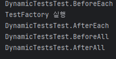

#  JUnit 정리

---
# 1. JUnit이란?
CRUD와 같은 작은 테스트 묶음을 수동으로 실행하는 것은 비교적 쉬운 일이지만, 같은 테스트를 반복적으로 실행하는 것은 비효율적이다.  
반복적인 작업을 자동화하기 위해 **켄트 벡(Kent Beck)** 과 **에릭 감마(Erich Gamma)** 는 장거리 비행 중에 `JUnit`이라는 단위 테스트 프레임워크를 만들었다.
---
## 단위 테스트(Unit Test)
단위 테스트는 **개별적인 작업 단위의 동작을 검사하는 테스트**를 의미한다.

### 단위 테스트 프레임워크 없이 테스트하는 경우
```java
public class CaculatorTest {
    private int errorCnt = 0;
    
    public void testAdd() {
        Calculator calculator = new Calculator();
        double result = calculaotr.add(10, 50);
				
        if (result != 60) {
            throw new Exception();
        }
    }
	
    public static void main(String[] agrs) {
        CalculatorTest test = new CalculatorTest();
        try {
            test.testAdd();
        } catch (Throwable e) {
            test.errorCnt++;
            e.printStackTrace();
        }
        if(test.errorCnt>0) {
            throw new Exception("에러 갯수" + errorCnt);
        }
    }
}

```
### 문제점
- `try catch`문이 많아지면서 코드가 복잡해진다. 
- 한눈에 어떤 테스트가 성공하고 실패 했는지, 어떤 에러가 발생했는지도 파악하기가 어렵다.

### **단위 테스트 프레임워크**가 따라야 하는 세가지 규칙
1. 단위 테스트는 다른 단위 테스트와 독립적으로 실행되어야 한다. 
2. 프레임워크는 각 단위 테스트의 오류를 파악하여 알려주어야 한다. 
3. 어떤 테스트를 실행할지 쉽게 정의할 수 있어야 한다. 


### JUnit을 사용한 단위 테스트

```java
    public class CalculatorTest {
	@Test
	public void testAdd() {
		Calculator calculator = new Calculator();
		calculator.add(10,50);
		assertEquals(60, result, 0);
	}
}
```
### JUnit을 사용했을때 장점 
- main 메서드에서 실행하지 않고 클릭만 하면 자동으로 테스트가 실행된다. 
- 테스트 코드를 작성하기 쉽다. 
- 한눈에 테스트의 결과를 파악할 수 있고, 어떤 테스트가 통과했고 실패했는지, 왜 실패했는지를 파악할 수 있다.

### 테스트를 하는 이유 
- 다른 기능을 추가하거나 기능이 수정될때 기존에 만들어둔 테스트가 통과되는지 확인할 수 있다. 

### 궁금한점 
- 테스트 클래스는 왜 public과 디폴트 접근 제어자로 제한을 두었는가? 자바의 리플렉션떄문에??

***

# 2. JUnit 핵심
### JUnit의 특징 
1. JUnit은 테스트 메서드의 격리성을 보장한다. 
2. 테스트 코드에서 의도치 않은 부수효과를 방지하기위해, @Test 메서드를 호출하기 전에 테스트 클래스 인스턴스를 매번 새로만든다. 
3. 그래서 각 테스트는 인스턴스 변수를 공유할 수 없다.

### 테스트의 생애주기
- @BeforeAll, @BeforeEach, @Test, @AfterEach, @AfterAll

### @DisplayName
- 어떤 테스트인지 작성하는데 사용된다. 
- 테스트 목적을 알려 줄수 있는 완전한 문장 수준으로 적는것이 일반적이다.
- 따로 적지 않으면 메서드명으로 리포트한다.

**그 외 어노테이션**<br>

Annotation| Description 
---|----
`@Disabled`| 테스트 하지 않을 메서드에 사용한다.<br> 테스트 하지 않을 이유에 대해 명시할 수 있다.<br>ex) @Disabled("기능 개발중")
`@Tag`| 태그를 사용해 테스트를 그룹으로 묶고 특정 카테고리만 수행할 수 있다.
---
### 단언문
결과값을 검증하기 위해서는 Assertions 클래스에서 제공하는 단언문 메서드를 사용한다. 
### 자주 사용하는 단언문 메서드
단언문 메서드|활용 목적
--|--
`assertAll`|인자로 전달된 여러 executable객체 중 어느것도 예외를 던지지 않는다고 단언한다.
`assertArraysEquals`|예상 배열과 실제 배열이 동등하다고 단언한다.
`assertEquals`|예상값과 실제값이 동등하다고 단언한다. 
`assertX(...,String message)`|실패했을 경우 meesage를 테스트 프레임워크에 전달하는 단언문
`assertX(..., Supplier<String> messageSupplier` | 실패했을때 messageSupplier를 테스트 프레임워크에 전달하는 단언문 

### `assertAll`
- 일부 단언문이 실패하더라도 모든 단언문을 항상 검증한다.
- 첫번째 파라미터인 heading은 assertAll 메서드 내에서 단언문이 어떤일을 하는지 알려준다. 또한 파라미터로 전달된 executable객체 중 하나가 예외를 던지는 경우 표시할 메시지이기도 하다.
```java
	assertAll("테스트가 정상적으로 동작하지 않았음",
			() -> assertEquals("관리자",admin),
			() -> assertFalse(isAdmin)
             );
```

### 람다식을 파라미터로
- `assertTrue` 메서드를 사용하면 조건이 참인지 검증한다. 
- `assertFalse` 메서드를 사용하면 조건이 거짓인지 검증한다.
- `assertNull` 메서드를 사용하여 객체가 존재하는지 검증할 수 있다. 

```java
assertTrue(userServiceTest.isAdmin(), // 만족하면
() -> "조회요청한 사용자가 있는지 확인") // 호출하지 않는다.
```
단언문에서 람다식을 파라미터로 사용하면 지연전달 덕분에 성능이 향상된다. 테스트하고자하는 대상(isAdmin)을 충족하면 람다식이 호출되지 않는다. 
<br>

### 제한 시간내에 작업을 수행할수 있는지 확인하는 메서드

메서드|설명
|--|--|
|assertTimeout|시간을 초과해도 진행되며 초과시간을 메시지로 알려준다.
|assertTimeoutPreemptively|메서드 시간이 지나면 테스트 객체를 중지시키고 지정시간안에 완료되지 못했다고 알려준다.

### 예외확인 메서드 `assertThrows`
```java
Throwable thrwoable = assertThrows(NoJobException.class,
	() -> systemUnderTest.run(1000)); //검증 후 에러시 예외반환
assertEquals("테스트 대상 시스템은 현재 작업이 없는지 확인",throwable.getMessage()); //예외가 맞는지 검증

```
### 가정문 
- 외부환경이나 제어할 수 없는 시간대,날짜 문제탓에 테스트가 실패할 수도 있다. 전제조건이 충족이 되어야 테스트가 실행 되어야 할때는 **가정문**을 사용한다.

```java
@BeforeEach
void setup() {
  assumeTrue(environment.isWindow()); // OS가 윈도우 일때만 테스트를 실행한다.
}

@Test
void testNoJobToRun() {
  assumingThat(() -> environment.getJavaVersion().equals(EXPECTED_JAVA_VERSION),() -> assertFalse(systemUnderTest.hasJobToRun)); //자바 버전이 기대하는 버전 일때만 assertFalse 단언문을 실행한다.
}
```
---
### JUnit5의 의존성 주입 
- 이전버전의 JUnit과는 다르게 JUnit5부터는 생성자와 메서드 파라미터를 가질수 있도록 허용했지만 의존성 주입으로 해결해야 한다는 점이 다르다.
기본으로 사용하는 파라미터 리졸버 3개 
1. `TestInfoParameterResolver`
   - TestInfoParameterResolver를 사용하면 테스트 클래스 생성자나 테스트 메서드에서 TestInfo 객체를 파라미터로 사용할 수 있다. TestInfo는 실행할 테스트의 디스플레이 네임,테스트 클래스,테스트 메서드,관련 태그등에 관한 정보를 가져온다.
```java
   @BeforeEach
   void setUp(TestInfo testInfo) {
      String displayName = testInfo.getDisplayName();
      assertTrue(displayName.equals("display name of the method") || displayName.equals("testGetNameOfTheMethod(TestInfo)"));
   }
```

2. `TestReporterParameterResolver`
   - TestReporterParameterResolver는 TestReporter 객체를 파라미터로 사용할 수 있다. 
   - TestReporter는 현재 실행되는 테스트에 추가적인 정보를 제공할떄 사용한다.
```java
	@Test
	void testReportSingleValue(TestReporter testReporter) {
		testReporter.publishEntry("Single value");
	}
```


3. `RepetitionInfoParameterResolver`
   - `RepetitionInfo`가 파라미터 타입일때 인스턴스를 리졸브하는 역할을 한다.
   - `@RepeatedTest` 애노테이션이 달린 테스트에 대한 정보를 가지고 있다.

---
### 반복 테스트
JUnit5에서는 `@RepetedTest` 애노테이션을 사용하여 지정한 반복 횟수만큼 테스트를 반복할 수 있다.
애노테이션의 name 속성을 사용하여 각 테스트에 디스플레이네임을 지정할 수 있다.

`@RepeatedTest` 애노테이션이 지원하는 플레이스홀더
- `{displayName}` : `@Repeqted` 애노테이션이 붙은 메서드의 디스플레이 네임
- `{currentRepetition}`: 현재 반복 인덱스
- `{totalRepetitions}`:총 반복 횟수
<br>

상기 내용처럼 RepetitionInfo 타입의 파라미터를 받아 반복에 대한 정보를 가져올수 있음.

---
### 파라미터를 사용한 테스트
- 하나의 테스트를 다양한 파라미터를 가지고 여러 번 실행하게 해주는 기능이다. 
- 파라미터를 사용한 테스트에는 `@ParameterizedTest` 애노테이션이 달려있다. 
  - `junit-jupiter-params`  의존성 필요
- 각 반복에 대한 파라미터를 제공하는 소스를 선언하면 데이터가 파라미터로 테스트 메서드에 전달된다.
### `@ValueSource`
문자열 배열을 입력값으로 지정 가능하고 문자열 배열로 부터 파라미터를 사용한 테스트에 순서대로 입력 데이터를 제공한다.
### `@EnumSouce`
파라미터에 열거형(enum)을 사용할 수 있다. names속성으로 사용할 enum을 지정하거나 제외할 수 있다.
> 예제 > [ParameterizedWithValueSourceTest.java](src%2Ftest%2Fjava%2Fetctest%2FParameterizedWithValueSourceTest.java)

Q) 여러개의 파라미터를 사용하려면 어떻게 해야될까?

---
### 동적 테스트
- 런타임에 테스트를 생성할 수 있는 동적 프로그래밍 모델
- 개발자가 팩터리 메서드를 작성하면 프레임워크가 **런타임**에 실행할 테스트를 생성한다.
- 팩터리 메서드에 `@TestFactory` 애노테이션을 달면 된다.<br>

`@Test` 애노테이션이 달린 보통의 테스트와 다른 생애 주기를 가진다.
* @BeforeEach,@AfterEach 애노테이션이 달린 메서드는 `@TestFactory` 메서드 전체에 대해 실행될뿐 개별 테스트 각각에 대해서는 실행되지 않는다.

**Q) BeforeAll,AfterAll 애노테이션이 동작하는 방식도 동일하다고 되어있는데 실제 테스트를 해보면 테스트가 종료된뒤에 동작하는 것처럼 보여짐** 


<br>
---
# 3. JUnit 아키텍처
> JUnit5가 JUnit4의 어떤 단점을 해결했는지, 두버전 간에 어떤 차이가 생겼는지를 살펴본다.
### 소프트웨어 아키텍처
- 소프트웨어 아키텍처란 소프트웨어 시스템의 기본구조를 말한다.
- 아키텍처 요소는 더 쉽게 교체할 수 있도록 구성해야한다.

-| JUnit4              | JUnit5                           |비고
--|---------------------|----------------------------------|--
아키텍처   | 모놀리식 아키텍처           | 모듈식 아키텍처                         |
기능확장| runner,`@RunWith(xxx.class)`사용 | extension,`@ExtendWith(xxx.class)` | 개발자가 커스텀하게 테스트의 기능을 확장할 수 있다.
interceptor| rule                | extension                        | - 테스트 메서드 호출을 가로채는 컴포넌트<br> - 테스트 메서드가 실행되기 전후에 다른작업을 수행할 수 있다. 

> 예제
> 
> [CaculatorTest.java](src%2Ftest%2Fjava%2Fjunit4%2FCaculatorTest.java) //runner
> 
> [CustomRuleTester.java](src%2Ftest%2Fjava%2Fjunit4%2FCustomRuleTester.java) //rule

### JUnit4 아키텍처의 단점 
- IDE나 빌드도구 등과 상호작용을 고려하여 설계되지 않아서, 상호간 지나지게 결합도가 높다.
- API가 유연하지 못하다.

> JUnit4의 단점들을 해결하기 위해 새로운 아키텍처와 그에 맞는 API가 생겨났고, 더작고 모듈화된 JUnit에 대한 요구가 생겨났다. 그것은 JUnit5의 탄생과 맞물렸다

---
## JUnit5 아키텍처
JUnit5는 JUnit이 발전할 수 있도록 모듈식으로 개발할 필요가 있었다. 그래서 하나로 되어있던 JUnit4 jar파일을 여러개의 작은 파일로 쪼개었다.<br>

**JUnit5 요구사항**
- 개발자가 주로 사용하는 테스트를 작성하기 위한 API
- 테스트를 발견하고 실행하는데 사용되는 메커니즘
- IDE나 빌드 도구와 쉽게 상호작용하고 테스트를 구동할 수 있는 API

### JUnit5 아키텍처는 세가지 모듈로 나뉜다
1. **JUnit Platform** : JVM 위에서 테스트 프레임워크를 구동하기 위한 기반이 되는 플랫폼.<br> 콘솔,IDE,빌드 도구에서 테스트를 구동할 수 있는 API도 제공한다.
2. **JUnit Jupiter**: JUnit5에서 테스트와 extension을 만들 수 있도록 프로그래밍 모델과 확장모델을 결합한것.
3. **JUnit Vintage**: JUnit Platform에서 JUnit3나 JUnit4 기반의 테스트를 실행하기 위한 테스트 엔진으로, 하위 호환성을 보장한다.
---
# 4. JUnit4에서 JUnit5로 전환하기
### JUnit4에서 JUnit5로 전환하는 주요 과정
- 의존성을 교체한다.
- JUnit4 애노테이션을 JUnit5 애노테이션으로 교체한다.
- 테스트 클래스와 메서드를 교체한다.
- JUnit4 rule과 runner를 JUnit5의 확장 모델로 교체한다.

### 사용자 정의 rule을 extension으로 전환하기
사용자 정의 **rule은** 테스트 실행 전후로 비슷한 작업이 필요한 경우 유용하다.

<br>JUnit4에서는 TestRule 인터페이스를 구현하는 클래스를 만들었다. <br>
Statement객체를 반환하는 apply(Statement,Description) 메서드를 재정의 해야 했는데, <br>Statement 객체는 JUnit 런타임 내의 테스트를 나타내며, evaluate 메서드로 테스트를 실행할 수 있었다.

```java
// CustomRule.class
@Rule
public CustomRule myRule = new CustomRule();

@Test
public void myCustomRuleTest() {
   System.out.println("Call of a test method");
}
```

```java
//CustomRule.class
@Override
public Statement apply(Statement statement, Description description) {
   this.base =statement;
   this.description = description;
   return new CustomStatement(base, description);
}
```

```java
//CustomStatement.class
@Override
public void evaluate() throws Throwable {
   System.out.println(this.getClass().getSimpleName() + " " + description.getMethodName() + " has started");
   try{
      base.evaluate();
   } finally {
      System.out.println(this.getClass().getSimpleName() + " " + description.getMethodName() + " has finished");
   }
}
```
JUnit5에서는 JUnit4의 rule을 extension으로 대체한다. <br>
extension을 사용하여 코드가 짧아지고, 애노테이션을 사용함으로서 코드가 선언적이게 된다. 
```java
public class CustomExtension implements AfterEachCallback, BeforeEachCallback {

	@Override
	public void beforeEach(ExtensionContext extensionContext) throws Exception {
		System.out.println(this.getClass().getSimpleName() + " " + extensionContext.getDisplayName() + " has started");
	}
	@Override
	public void afterEach(ExtensionContext extensionContext) throws Exception {
		System.out.println(this.getClass().getSimpleName() + " " + extensionContext.getDisplayName() + " has finished");
	}
}
```
JUnit5 extension 사용
```java
@ExtendWith(CustomExtension.class)
public class JUnit5CustomExtensionTester {
   @Test
   void myCustomRuleTest() {
      System.out.println("Call of a test method");
   }
}
```

---
# 5. 소프트웨어 테스트 원칙
#### 1장에서 단위테스트를 해야하는 이유를 간략하게 알아보았다. 5장에서는 단위 테스트가 무엇인지 왜 단위테스트를 해야하는지 알아본다.
### 단위테스트의 핵심 목표
애플리케이션이 제대로 작동하는지 확인하고 사전에 버그를 찾아내는 것.

| Q) 기능테스트로 하면되는데 왜 단위테스트를 해야될까?                                                                                                                                    |
|-------------------------------------------------------------------------------------------------------------------------------------------------------------------|
| A) <br/>- 단위테스트는 보다 다양한 기능을 제공한다.<br/> - 테스트커버리지를 높일 수있다.<br/>- 팀 생산성이 향상된다.<br/>- 회귀를 사전에 발견하여 디버깅 작업을 줄일 수 있다.<br/>- 소스를 리팩터링할 수 있다.<br/>-애플리케이션 기능 구현에 도움이 된다. |
> 소프트웨어 개발에서 **"회귀(Regression)"** 란, 기존에 정상적으로 동작하던 기능이 새로운 코드 변경으로 인해 갑자기 오작동하는 현상을 의미합니다.
---
### 테스트 유형
**단위테스트**    | 소스 코드의 개별 단위를 테스트하여 해당 코드를 사용할 수 있는지를 결정하는 소프트웨어 테스트 기법
:-------------:|--
 **통합테스트**    | 대상환경에서 실행 가능한 컴포넌트간의 상호작용을 테스트하는 것
 **시스템 테스트**  | 시스템이 구체화된 요구사항을 만족하는지 평가하기 위해 완전한 통합 환경에서 수행하는 테스트 
 **인수 테스트**   | 애플리케이션이 고객이나 이해관계자가 저의한 목표를 달성하는지 확인하기 위해 사용한다.
### 블랙박스 테스트 대 화이트박스 테스트
**블랙박스 테스트** | - 내부동작을 모르는 상태에서 시스템 외부인터페이스만을 가지고 시스템의 정확성을 검증하는 테스트
:--:|--
**화이트박스 테스트**|**- 테스트 프로세스가 다른 구성요소 와 상호작용하는 방식을 알고 실행하는 테스트.<br>- 블랙박스 테스트보다 더많은 실행 경로를 포함할 수 있으며 더 나은 테스트 커버리지를 얻을수 있다.**


